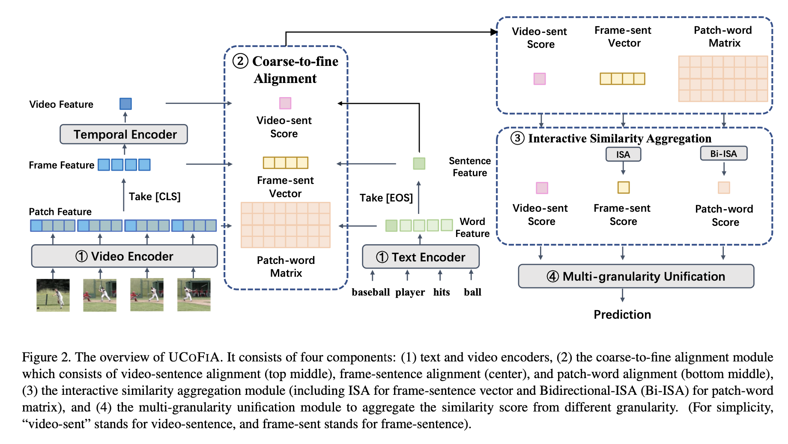

# UCoFiA: Unified Coarse-to-Fine Alignment for Video-Text Retrieval (ICCV 23)

* Authors: [Ziyang Wang](https://ziyangw2000.github.io/), [Yi-Lin Sung](https://ylsung.github.io/), [Feng Cheng](https://klauscc.github.io/), [Gedas Bertasius](https://www.gedasbertasius.com/), [Mohit Bansal](https://www.cs.unc.edu/~mbansal/)
* Paper link: [arXiv](https://arxiv.org/abs/2309.10091)

* Introduction: UCoFiA captures the cross-modal similarity information at different granularity levels(video-sentence, frame-sentence, pixel-word) and unifies multi-level alignments for video-text retrieval. Our model achieves state-of-the-art results in five benchmark datasets including MSR-VTT, MSVD, Activity-Net, DiDeMo, and VATEX.




# Code structure
```bash

# train code for UCoFiA
./train

# video-to-text retrieval evaluation with SK-norm
./eval_v2t

# text-to-video retrieval evaluation with SK-norm
./eval_t2v
```

# Update
We release the UCOFIA's checkpoint on the MSR-VTT dataset in https://drive.google.com/file/d/1-zynuNEI1u0TwNxw2R163kX4kocWDsIu/view?usp=sharing

# Setup

## Install Dependencies

1. (Optional) Creating conda environment

```bash
conda create -n ucofia python=3.8
conda activate ucofia
```

2. install pytorch: torch==1.12.1, torchvision==0.13.1

3. install other dependencies
```bash
pip install -r requirements.txt
```

## Download CLIP (ViT-B/32) weight
```bash
wget -P ./modules https://openaipublic.azureedge.net/clip/models/40d365715913c9da98579312b702a82c18be219cc2a73407c4526f58eba950af/ViT-B-32.pt
```

# Dataset Preparation
## Download data
We test our model on:
+ [MSR-VTT](http://ms-multimedia-challenge.com/2017/dataset)

+ [MSVD](https://www.cs.utexas.edu/users/ml/clamp/videoDescription/)

+ [Activity-Net](http://activity-net.org/download.html)

+ [DiDeMo](https://github.com/LisaAnne/LocalizingMoments)

+ [VATEX](https://eric-xw.github.io/vatex-website/download.html)

Please refer to [CLIP4Clip](https://github.com/ArrowLuo/CLIP4Clip) for downloading the first 4 datasets and [TS2-Net](https://github.com/yuqi657/ts2_net) for downloading VATEX dataset. 

## Compress raw video
We follow [CLIP4Clip](https://github.com/ArrowLuo/CLIP4Clip) to compress all video to 3fps, 224*224.

# Training and Inference
We provide UCoFiA training and evaluation script examples as follows. Please customize your data path in the scripts. 

## 1) Train UCoFiA on MSRVTT dataset
```bash
cd ./train
sh scripts/train_msrvtt.sh
```

## 2) Evaluate text-to-video retrieval with SK-norm on MSR-VTT dataset

To leverage SK-norm in inference time, please first modify the checkpoint path in line xxx of ./eval_t2v/main_ucofia.py to the saved best checkpoint path in the training stage (you can evaluate multiple checkpoints for better results).

```bash
cd ./eval_t2v
sh scripts/eval_msrvtt.sh
```


## 3) Evaluate video-to-text retrieval with SK-norm on MSR-VTT dataset

To leverage SK-norm in inference time, please first modify the checkpoint path in line xxx of ./eval_t2v/main_ucofia.py to the saved best checkpoint path in the training stage (you can evaluate multiple checkpoints for better results).

```bash
cd ./eval_v2t
sh scripts/eval_msrvtt.sh
```


# Acknowledgments
We thank the developers of [X-CLIP](https://github.com/xuguohai/X-CLIP), [TS2-Net](https://github.com/yuqi657/ts2_net), [CLIP4Clip](https://github.com/ArrowLuo/CLIP4Clip), [CLIP](https://github.com/openai/CLIP) for their public code release. We also thank the authors of [NCL](https://arxiv.org/pdf/2212.11790.pdf) for the helpful discussion. 


# Reference
Please cite our paper if you use our models in your works:

```bibtex
@article{wang2023unified,
  title={Unified Coarse-to-Fine Alignment for Video-Text Retrieval},
  author={Wang, Ziyang and Sung, Yi-Lin and Cheng, Feng and Bertasius, Gedas and Bansal, Mohit},
  journal={arXiv preprint arXiv:2309.10091},
  year={2023}
}
